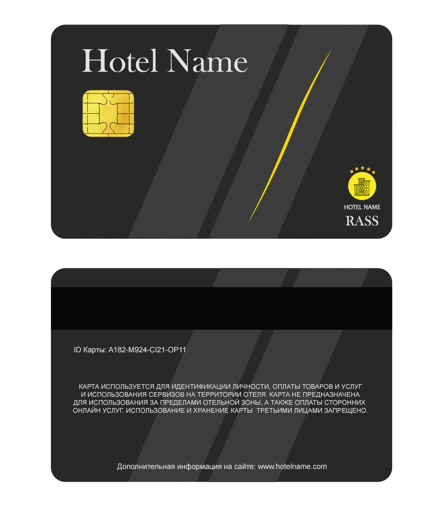

# RASS — Recreation Area Simplification System
1.  <a href="#что-это">Что это?</a>
2.  <a href="#что-включает-в-себя">Что включает в себя?</a>
3.  <a href="#зачем-это-нужно">Зачем это нужно?</a>
4.  <a href="#способна-ли-она-грамотно-конкурировать">Способна ли она грамотно конкурировать?</a>

### Что это?
RASS - это комплекс програмного и аппаратного обеспечения, расчитанный на использование в среде гостиничного бизнеса для упрощения использования предоставляемых гостиницей сервисов.

### Что включает в себя?

1.	<a href="#reg">Сервис регистрации посетителей</a>
2.	<a href="#ident">Сервис идентификации личности</a>
3.	<a href="#kassa">Сервис оплаты за счет RFID меток</a>
4.	<a href="#pay">Сервис кассового аппарата</a>

### Зачем это нужно?
1.	Для развития отельного бизнеса путём внедрения в него новых технологий
2.	Для автоматизации бизнес-процессов, благодаря которым будут увеличены скорости обработки информации и при этом сокращены ошибки
3.	Предоставление удобств и безопасности клиентам, внедряя многофункциональный комплекс ПО и АО, благодаря которым будут сокращены очереди на ресепшене, автоматизированы идентификации личностей, внедрены удобные способы оплаты всех услуг в "Зоне отдыха" по карточке предприятия

### Способна ли она грамотно конкурировать?
Да, так как в данной системе упор ставится на качество и долгосрочное обслуживание. Система RFID считывателей и меток предоставляет посетителям отельного комплекса безопасность их средств, удобство и быстроту в пользовании, а персоналу упрощённое обслуживание клиентов.

## Сервис регистрации посетителей

### Что входит:
1.  Веб панель для сотрудников
2.  RFID считыватели, метки
3.  Устройство поддерживающее возможность взаимодействия с онлайн веб-страницами

### Порядок действий:
Сотрудник отеля, после обращения к нему с просьбой о регистрации посетителя, обязан запросить у него паспортные данные. Затем сотрудник должен внести личные данные посетителя в базу данных, а так же предоставить возможность ему придумать пароль к своей учётной записи. После регистрации сотрудник должен выдать RFID метку и данные учётной записи посетителя.

## Сервис идентификации личности
### Что входит:
1.  Веб панель идентификации для сотрудников
2.  RFID считыватели
3.  Устройство поддерживающее возможность взаимодействия с онлайн веб-страницами
### Порядок действий:
Сотрудник имеет право потребовать идентификацию личности на территории отельного комплекса способом приложения карты к RFID считывателю, если все данные совпадают, то посетитель может быть свободен, в случае ошибки идентификации личности, сотрудник должен сопроводить посетителя к ресепшену для дальнейшего удостоверения личности.

## Сервис кассового аппарата
### Что входит:
1.  Сервис оплаты за счет RFID меток
2.  Веб панель кассового аппарата
3.  Устройство поддерживающее возможность взаимодействия с онлайн веб-страницами
### Порядок действий:
Посетитель, для того чтобы приобрести какие либо услуги/товары должен будет предоставить свою RFID метку сотруднику отеля с кассовым аппаратом. Кассовый аппарат в свою очередь определяет кол-во товара/предоставляемых услуг, вычисляет их общую стоимость и считывает RFID метку посетителя, после чего происходит снятие средств со счёта посетителя с помощью сервиса оплаты.

## Сервис оплаты за счет RFID меток
### Что входит:
1.  Веб панель панель для сотрудников
2.  RFID считыватели, метки
### Порядок действий:
Во время оплаты кассир называет конечную сумму и активирует RFID сканер. Пользователь прикладывает карту к сканеру, и с нее считывается идентификатор пользователя. По идентификатору с аккаунта списывается необходимая сумма, и при успешном проведении операции выдается заказ или предоставляется услуга.

# Роли на проекте

## Project Manager / Quality Assurance
<a href="https://github.com/Iveen1">Поляков Антон</a>

## Backend developer
<a href="https://github.com/fadesml">Буняк Андрей</a>  

## Frontend developer
<a href="https://github.com/iroQQuois">Руденко Вадим</a>

## Layout developer
<a href="https://github.com/nikitazyz">Никита Зыз</a>

## User Interface Designer
<a href="https://github.com/Pusja132">Бандурин Андрей</a>

# Card Design
 
